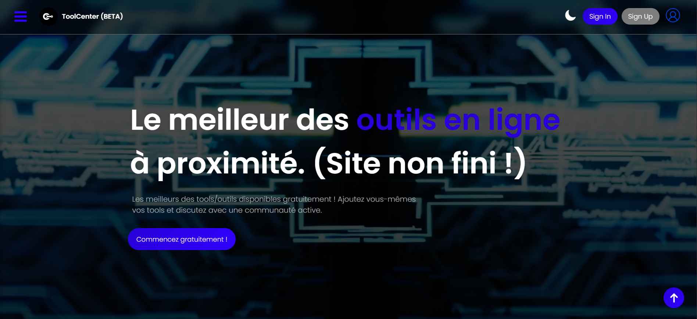
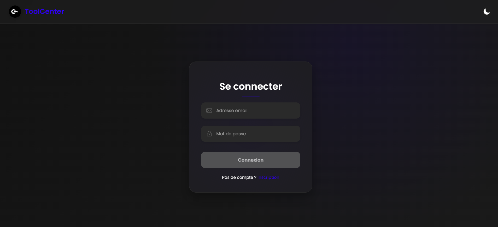
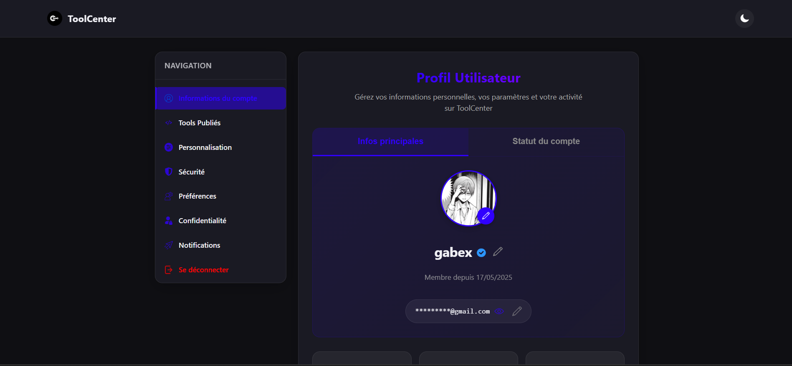

# 🚀 **Tool Center**

> **Tool Center**, c’est **LE** projet phare de **[@gabex749](https://github.com/gabex749)**.  
> Un concentré de **code**, de **passion**, et d’**utilité**, taillé pour ceux qui veulent des outils de qualitée.

---

## 🌐 **Aperçu rapide**

**Tool Center**, c’est une plateforme web pensée pour :
- 🔧 **Créer & publier** tes propres outils
- 💬 **Liker, commenter et partager** ceux des autres
- 👤 **Gérer ton compte** : avatar, paramètres, stats persos
- 🛡️ Un **système de modération** ultra propre
- ⚖️ **Sanctions contestables** via un panel dédié
- 📜 **Logs complets** : utilisateurs, admins, actions
- ⚡ Un **design responsive**, fluide et sans chichis

 

---

## 🧠 **Pourquoi Tool Center existe ?**

Parce que le monde avait besoin :
- D’un **hub d’outils web** open-source, **sans pubs**, **sans trackers**
- D’un endroit où **les devs indés peuvent briller**
- D’un site **moderne**, **rapide** et surtout **pas dégueu**
- D’un projet fait **par un passionné**, pour les passionnés

---

## 🧱 **Architecture du projet**

| 🧩 Composant       | ⚙️ Technologies utilisées             |
|-------------------|-------------------------------------|
| **Backend API**   | Go (Golang) + MariaDB               |
| **Frontend**      | HTML, JS, CSS (vanilla stylé)       |
| **Auth**          | Email, tokens SHA-256 hashés, IDs UUIDv7, vérif,sessions   |
| **Hosting**       | Raspberry Pi 5                      |
| **Proxy / HTTPS** | Nginx + SSL via Cloudflare          |
| **Domaines**      | [tool-center.fr](https://tool-center.fr) & [gabex.xyz](https://gabex.xyz) |

---

## 📸 **Galerie**

| 🔐 Connexion                         | 📊 Tableau de bord                  |
|-------------------------------------|------------------------------------|
|         |  |

> _Ces photos ont étés réalisés le 24/05/2025. Il peut donc y avoir une différence entre les photos et la réalitée actuelle._

---

## 🧙‍♂️ **Le créateur**

Développé par **[@gabex749](https://github.com/gabex749)**,  
jeune dev full stack passionné par l’**électronique**, la **cybersécurité**, et les **projets innovant**.  
👉 **Tool Center** est son projet **le plus gros, le plus poussé et le plus ambitieux**.

---

## ❤️ **Soutien & Contributions**

**Tool Center** est un projet **open-source**, fait avec :
- 💕 Amour
- ⏱️ Patience et determination
- ❤️‍🔥 Passion pour l'informatique

Tu veux participer, contribuer, ou signaler un bug ?  
→ **Tu peux me contacter sur gabex@gabex.xyz**

---

## 🔮 **À venir très bientôt**

- 🔄 Mise à jour auto des outils postés
- 📊 Stats publiques & classement utilisateurs
- ⚔️ Gamification + système de niveau
- 🌍 Traductions multilangues

---
## **© Gabriel B., 2024-2025 — Tous droits réservés.**
