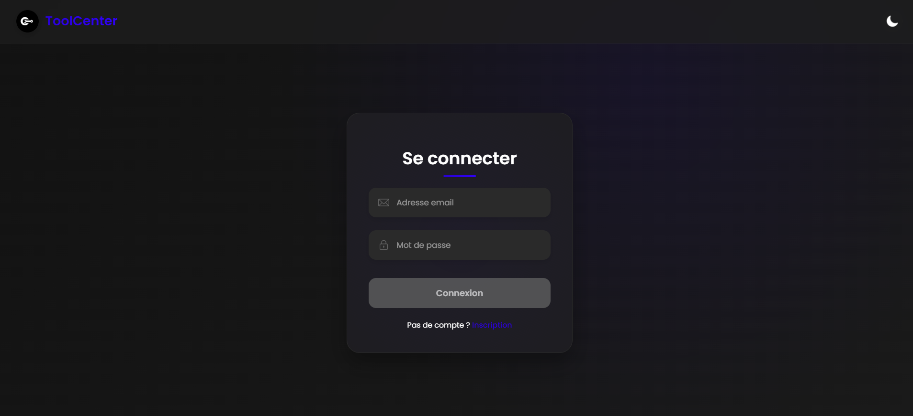
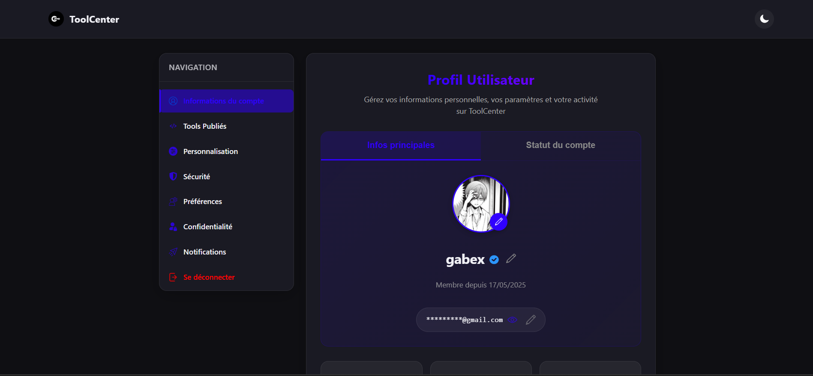

# 🚀✨ **Tool Center**


<p align="center">
  <a href="LICENSE"></a>
  <a href="https://github.com/gabrielb0x/tool-center/actions"></a>
  <a href="https://github.com/gabrielb0x/tool-center/releases"></a>
  <a href="https://github.com/gabrielb0x/tool-center/stargazers"></a>
  
  
  
</p>

> **Tool Center** is a **tracker‑free**, **ad‑free** playground where indie devs can **🚀 create**, **📨 publish** & **🔍 discover** useful web tools. Built with ❤️, ☕ and way too many commits at 3 a.m.

---

## 📑 Table of Contents

* [🧠 About](#-about)
* [✨ Features](#-features)
* [🚀 Live Demo](#-live-demo)
* [⚡ Quick Start](#-quick-start)
* [🧱 Project Structure](#-project-structure)
* [🔧 Configuration](#-configuration)
* [🌍 Deployment](#-deployment)
* [📡 API Overview](#-api-overview)
* [🧪 Testing](#-testing)
* [🤝 Contributing](#-contributing)
* [👥 Community](#-community)
* [🔮 Roadmap](#-roadmap)
* [📜 Changelog](#-changelog)
* [📝 License](#-license)

---

## 🧠 About

**Tool Center** began as a passion project by [@gabrielb0x](https://github.com/gabrielb0x), and has grown into a modern, community-powered platform. The mission 🔭: provide a **⚡ lightning-fast**, **🔒 privacy-focused**, and **✨ engaging** space for publishing and sharing useful web tools — without ads or invasive trackers.

* 🏎️ **Runs on a Raspberry Pi 5** without breaking a sweat
* 🕵️ **Zero trackers** – your data ≠ product
* 🛠️ **One‑click publish** workflow (UI & API)
* 🙌 **Transparent moderation** with public logs & audit trail

> **Status:** *Beta* – stable but expect the occasional paper‑cut.

---

## ✨ Features

| 🗂️ Category       | 🌟 Highlights                                                                               |
| ------------------ | ------------------------------------------------------------------------------------------- |
| 🙍‍♂️ **Accounts** | Sign‑up / login, avatar upload, profile stats, social links                                 |
| 🔐 **Security**    | Password reset, **TOTP 2FA**, active sessions, brute‑force shield, rate‑limit, anti‑spam    |
| 🛠️ **Tools**      | Create, edit, publish, like, comment, share, **versioning** *(coming)*                      |
| 🛡️ **Moderation** | Role‑based perms, temp/perma bans, auto‑unban, sanction appeals, JSON exportable logs       |
| 🎨 **UX**          | Responsive layout, dark mode, keyboard shortcuts, accessible components, PWA offline splash |
| 🏗️ **DevOps**     | OpenAPI 3 docs, GitHub Actions CI, Docker/Compose, semantic releases, Dependabot            |
| 📈 **Analytics**   | Self‑hosted [Plausible](https://plausible.io/) integration *(opt‑in)*                       |

---

## 🚀 Live Demo

🔗 **[https://tool-center.fr](https://tool-center.fr)** — jump in and break things! (it’s a test‑bed)

|                       🔐 Login                       |                         📊 Dashboard                        |
| :--------------------------------------------------: | :---------------------------------------------------------: |
|  |  |

*Screenshots: **2025‑05‑24** – the UI changes faster than you can say “hot‑reload”.*

---

## ⚡ Quick Start

### 🐳 Option A — Docker *(recommended)*

```bash
# 1 › clone & cd
git clone https://github.com/gabrielb0x/tool-center.git && cd tool-center

# 2 › copy env templates
cp api/example\ config.json api/config.json
touch api/config.secrets.json           # optional secrets override
cp deploy/.env.example deploy/.env

# 3 › spin it up 🚀
docker compose up -d --build
```

Stack:

* **api** ← Go 1.22 + Gin
* **db** ← MariaDB 11 (persisted volume)
* **frontend** ← Nginx static

### 🛠️ Option B — Manual

> Requires **Go 1.22+** & **Node 20+**.

1. **API**

   ```bash
   cd api
   go mod tidy && go run .
   ```
2. **Frontend**

   ```bash
   cd ../frontend
   npm i && npm run build  # outputs ./dist
   ```
3. **Proxy** – see [`deploy/nginx.conf`](deploy/nginx.conf) for TLS & caching.

---

## 🧱 Project Structure

```text
📦 tool-center
 ┣ api/            # Go source, config, migrations, mail templates
 ┣ frontend/       # Vanilla JS + Vite static site
 ┣ deploy/         # Docker, Nginx, systemd, k8s (WIP)
 ┣ scripts/        # Helper CLI & data seeders
 ┣ docs/           # Architecture diagrams, ADRs, threat‑model
 ┣ tests/          # Go + JS test suites
 ┗ .github/        # Workflows, issue templates, FUNDING.yml
```

---

## 🔧 Configuration

Everything lives in **`api/config.json`** 🔒 (override secrets in `api/config.secrets.json`).

| 🗝️ Key               | 📓 Description | 🧩 Example                                              |
| --------------------- | -------------- | ------------------------------------------------------- |
| `port`                | API port       | `8080`                                                  |
| `database.dsn`        | MariaDB DSN    | `user:pass@tcp(db:3306)/toolcenter`                     |
| `smtp`                | Mail server    | `{ "host":"smtp.gmx.net", "port":587, … }`              |
| `cors_allowed_origin` | CORS origins   | `"https://tool-center.fr,https://admin.tool-center.fr"` |
| `rate_limit.limit`    | Requests / IP  | `200`                                                   |
| `status_banner`       | UI banner      | "Maintenance 22:00‑23:00 UTC"                           |

> **Tip:** all fields are commented – open the file, read, tweak, profit.

---

## 🌍 Deployment

| 🌏 Where           | ⚙️ How                                        | 📝 Notes                                 |
| ------------------ | --------------------------------------------- | ---------------------------------------- |
| **Raspberry Pi 5** | Systemd units in `deploy/systemd/`            | < 1 GB RAM required                      |
| **Cloudflare**     | Free SSL, caching, WAF                        | orange‑cloud CNAME + *Full (strict)* TLS |
| **Docker Hub**     | `docker pull gabrielb0x/tool-center` *(soon)* | Version‑tagged images                    |
| **Kubernetes**     | Helm chart *(WIP)*                            | autoscale & GitOps ready                 |
| **Backup**         | `scripts/backup.sh` (mysqldump + rclone)      | Cron‑friendly                            |

---

## 📡 API Overview

RESTful, JSON, versioned (`/v1`). Full docs auto‑generated (Swagger / ReDoc).

```bash
curl -X POST https://api.tool-center.fr/v1/auth/login \
     -H "Content-Type: application/json" \
     -d '{"email":"user@site.com","password":"hunter2"}'
```

### Frequent Endpoints

| 🛠️ Verb | 🛣️ Path                  | 📚 Purpose                    |
| -------- | ------------------------- | ----------------------------- |
| `POST`   | `/v1/auth/login`          | Login & obtain JWT            |
| `GET`    | `/v1/tools`               | List public tools (paginated) |
| `POST`   | `/v1/tools`               | Publish new tool              |
| `GET`    | `/v1/mod/logs`            | Moderation logs (admin)       |
| `POST`   | `/v1/admin/users/:id/ban` | Ban user                      |

More? → hit `/docs/swagger/`.

---

## 🧪 Testing

<a id="testing"></a>

```bash
# Go unit tests
a) cd api && go test ./...

# Frontend lint + unit tests
b) cd ../frontend && npm run lint && npm test
```

CI (GitHub Actions) executes both pipelines on every PR.

---

## 🤝 Contributing

1. **Fork** & `git checkout -b feat/cool-stuff dev` 📚
2. **Commit**: `type(scope): subject` ✅ (see Conventional Commits)
3. **Lint / test** before PR 🔍
4. **Open PR** & fill template ✍️

First‑timer? Check [good first issue](https://github.com/gabrielb0x/tool-center/labels/good%20first%20issue).

### Code Style

* **Go**: `go fmt`, `go vet`, `golangci‑lint run`
* **JS**: `eslint`, `prettier`, `vitest`

---

## 👥 Community

* 💬 **Discord** → [https://discord.gg/toolcenter](https://discord.gg/toolcenter)
* 🐦 **Twitter/X** → [https://x.com/toolcenter](https://x.com/toolcenter)
* 📝 **Blog** → [https://blog.tool-center.fr](https://blog.tool-center.fr) *(soon)*

Join to get help, show off tools, or drop dank memes.

---

## 🔮 Roadmap

* [ ] 🔄 Tool auto‑update (webhooks)
* [ ] 📊 Public stats & leaderboard
* [ ] ⚔️ Gamification (XP, badges)
* [ ] 🌐 Multi‑language UI (i18n)
* [ ] 🐳 Docker Hub image
* [ ] 🔐 Security audit guide
* [ ] 🦾 AI‑powered code snippets for docs
* [ ] 📱 Progressive Web App (installable)

💡 Upvote or suggest in [Discussions](https://github.com/gabrielb0x/tool-center/discussions).

---

## 📜 Changelog

See [CHANGELOG.md](CHANGELOG.md) for semantic‑versioned release notes.

---

## 📝 License

Copyright © **2024‑2025 Gabriel B.** &#x20;
nReleased under the **[MIT License](LICENSE)**.

---

> *Built with 🤘, insomnia & way too many cups of coffee.*
